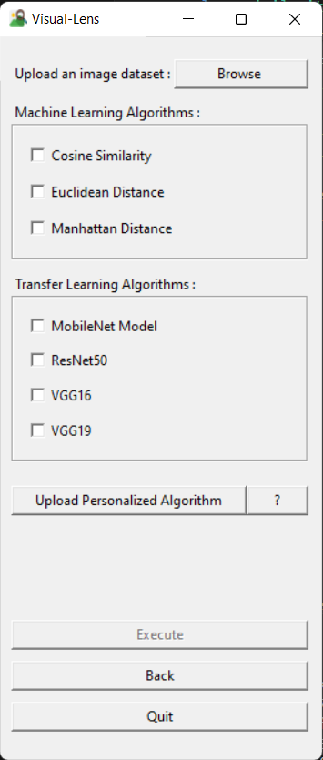
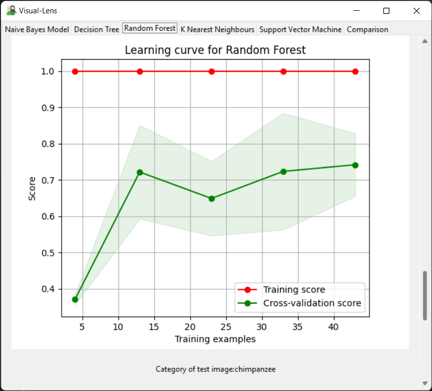

# **Visual-Lens**  


## **Overview**
This project provides a GUI-based tool using Tkinter for performing various machine learning operations on image data, such as classification, clustering, and similarity checks, while also enabling performance analysis using data visualization. Users can select specific tasks and load their own datasets or algorithms for analysis. 

## **Features**
- **GUI Interface**: 
The GUI module provides an interactive interface for users to interact with the tool. It serves as the primary point of interaction, allowing users to input image data, select algorithms, configure a few parameters, and view analysis results. Switchable frames allows the user to move back and forth in the application.
- **Image Similarity**: 
Utilizes machine learning algorithms such as **Cosine Similarity**, **Euclidean Distance**, and **Manhattan Distance** to find similarities between images. It takes one image as input from the dataset fed and provides 4 similar images from the dataset. A comparative study of all the 4 images are shown with respect to the various algorithms for each metric is visualized as the result.
- **Image Classification**: 
Implements machine learning algorithms including **Naive Bayes Model**, **Decision Tree Model** and **Random Forest Model** for image classification tasks. It takes the directory containing the images, the text file containing the labels, and a test image as input. It produces the visualization of various metrics for each of the algorithms.
- **Image Clustering**: 
Utilizes machine learning algorithms such as **K-Means**, **Agglomerative hierarchical clustering** and **Spectral Clustering** to group unlabelled images. It takes the file containing the images as input and produces the comparative analysis of the various metrics is visualized.
- **Transfer Learning**: 
Provides transfer learning techniques using pre-trained models such as **MobileNet**, **ResNet50**, **VGG16**, and **VGG19**. The models serve a feature extractor and is used to augment the features extracted to the machine learning algorithms to significantly improve thier performance
- **Interactive Visualization**:
Presents results in an interactive graphical format, allowing users to interpret and compare the performance of different algorithms and techniques easily. Users can save the required metric visualization for future use.
    **Classification Metrics**:
  For individual algorithms:
    - Confusion Matrix
    - Roc Curve
    - Learning Curve
    - Precision-Recall Curve
    - Calibration Curve
    - Cumulative Gain Curve
  
  For Comparison among algorithms:
    - Accuracy
    - Precision
    - Recall (Sensitivity)
    - F1-Score
  
    **Clustering Metrics**:

    For individual algorithms:
    - Dendrogram 
    - Silhoutte Diagram
    - Clusters formed
  
    For Comparison among algorithms: 
    - Cohesion
    - Separation 
    - Dunn Index
    - Davies-Doublin Index 
    - Calinski-Harabasz Index
    
    **Image Similarity Metrics**:
    For individual algorithms:
    - Most Similar 4 images along with the test image
 
    For Comparison among algorithms:
    - Structural Similarity Index (Ssim) 
    - Orb Feature-Based Comparison
    - Histogram Correlation 
    - Histogram Bhattacharyya Distance
    - Histogram Intersection 
- **Extensibility**:
Users and researchers can also integrate their own customized algorithms to be compared with the other algorithms integrated or inbuilt. This can be done by serializing the required data of the algorithm into a pickle.

---

## **Installation**
To install the required dependencies and run this project on your local machine:

1. Clone this repository:
   ```bash
   git clone https://github.com/sultanasabiha/VisualLens-Project
   cd VisualLens-Project
   ```

2. Install the required Python packages:
   ```bash
   pip install -r requirements.txt
   ```
---
## **Usage**
1. To start the GUI application, run the following command:
  ```bash
  python gui.py
  ```

  This will launch the GUI Interface. The GUI will present the various options for different tasks: Image Similarity, Image 	Classification or Image Clustering.
  <p align="center">
    
  </p>

2. Select a Task:
  Click on the option that corresponds to the task you wish to perform:
	- Image Similarity: To find and compare similar images within a dataset.
	- Image Classification: To categorize images into predefined classes.
	- Image Clustering: To group images into clusters based on visual similarity.

3. Input details (if applicable):
	-Select classification type in case of Image classification.
	-Enter the number of clusters in case of Image clustering.
<p float="left" align="center">
  
   
  
</p>

4. Upload Necessary Files:
  After clicking on the Browse Button, follow the on-screen instructions to upload the 	required files. This typically involves:
	- Image Dataset: The collection of images to be processed.
	- Labels (if applicable): Ground truth labels for image classification tasks.
	- Test Image (if applicable): A test image to feed to the algorithm for image similarity or classification tasks.
5. Select Machine Learning/Transfer Learning Algorithms:
  Choose from the list of available machine learning algorithms and transfer learning 	techniques. This may include:
     - Image Similarity: Cosine Similarity,Euclidean Distance,Manhattan distance.
     - Image Classification: Naive Bayes,Decision Tree,Random Forest.
     - Image Clustering: K-Means,Agglomerative Hierarchical Clustering,Spectral Clustering.
     - Transfer Learning: MobileNet,ResNet50,VGG16,VGG19.

6. Upload personalized algorithms (if required):
  Customized algorithms can be uploaded by loading the required serialized pickle file as 	mentioned in the instructions. We can add/remove them as required.
  <p float="left" align="center">
      
  </p>

7. Execute the Task:
Once all the necessary files are uploaded and selections are set, click the "Execute" button. The tool will then begin processing your images based on the selected task and settings.

8. View Results:
  After the processing is complete, the tool will display the results through interactive visualizations in a separate window. Metrics for the respective application and algorithm will be displayed.
  For example:
<p float="left" align="center">
  
  
  
  Sample Classification Results
</p>
<br>
<p float="left" align="center">
  
  
  
  Sample Clustering Results
</p>  
<br>
<p float="left" align="center">
  
  
  
  Sample Similarity Results
</p> 

9. Save Results (if required) and Close:
  Optionally, the results can be saved for further analysis or reporting. Close or execute more algorithms as required.

---

## **Architecture**


1. Module: similarity.py
Implements all similarity algorithms along with tranfer learning algorithms, and returns the required data back to gui-module. 

2. Module: classification.py
  Implements all classification algorithms along with tranfer learning algorithms, and returns the required data back to gui-module. 

3. Module: clustering.py
Implements all clustering algorithms along with tranfer learning algorithms, and returns the required data back to gui-module.

4. Module: visualize.py
Visualizations are used to present the results of image analysis tasks, such as image similarity scores, classification labels, clustered image groups, and to compare the performance of different machine learning algorithms and techniques. All of these are displayed in a secondary window.

5. Module: gui.py 
The application features a user-friendly interface with a start screen that allows users to select tasks such as Similarity, Classification, and Clustering. Smooth navigation between modules ensures easy task switching. Additionally, a file browsing feature simplifies uploading datasets and algorithms, allowing users to integrate their data and custom algorithms seamlessly.

<p align="center">

</p>


---

